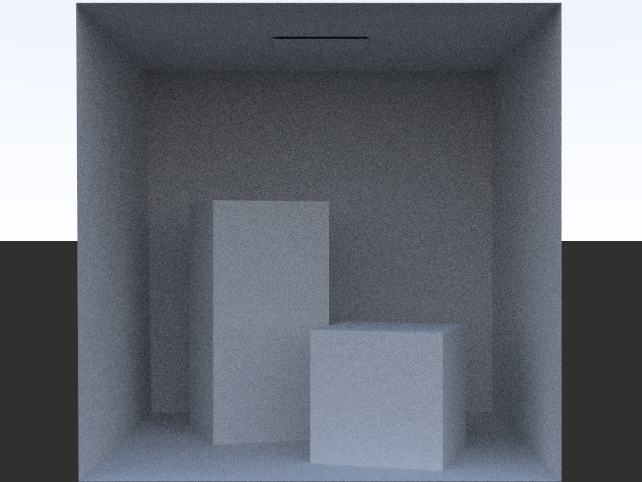
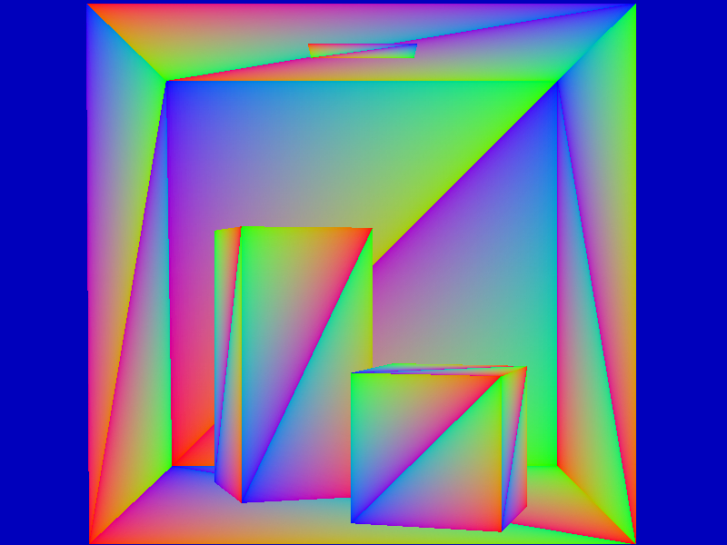
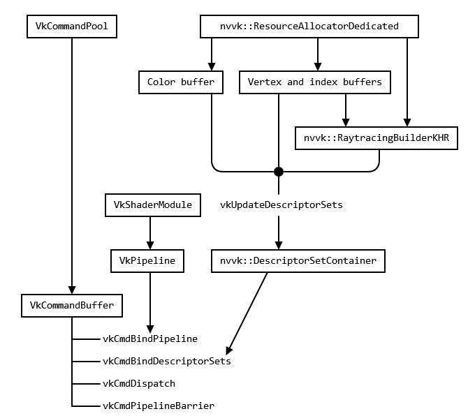

# Path Tracer

<i>Path tracers trace paths of light through scenes to render images. Most path tracers today use geometric optics, which assumes that light travels along rays. </i>



# Overview

A small implementation of a path tracer from the project [VK Mini Path Tracer](https://github.com/nvpro-samples/vk_mini_path_tracer) of NVIDIA's public repository, using C++, GLSL, Vulkan and NVIDIA's graphics helper libraries.

This repository is purely for educational purposes with some personal notes made along the way to try to understand the basics of Computer Graphics and Vulkan, GLSL, and C++ projects. 

# Environment Setup

### 1. Dependencies (Visual Studio, Vulkan Drivers and CMAKE)
- [Visual Studio](https://visualstudio.microsoft.com/downloads/)
- [Vulkan Windows SDK](https://vulkan.lunarg.com/sdk/home)
- [Nvidia Vulkan Drivers](https://developer.nvidia.com/vulkan-driver)
- [CMAKE](https://cmake.org/download/)

### 2. Clone (Download)
```bash
## Download the repository
git clone https://github.com/thorgalwulf/path_tracer.git

## Download NVIDIA static libraries for graphics
git clone https://github.com/nvpro-samples/nvpro_core.git 
```

### 3. Build
```bash
## CMAKE GUI
source: .../path_tracer_vulkan/vk_mini_path_tracer 
build: .../path_tracer_vulkan/vk_mini_path_tracer/build
add entry: “Name” = CMAKE_BUILD_TYPE, “Type” = STRING, “Value” = Debug
configure: default x64
configure - generate - open project
```

### 4. Configuration
```bash
## VS Studio
## Set as startup project to avoid 'Access is denied' error
vk_mini_path_tracer_edit.sln
```

### 5. Run
- Open the solution file on VS Studio and then the source files to compile and run main.cpp. 
- The .exe files will be on the bin_x64 debug folder.
- Shader files will be on vk_mini_path_tracer/_edit folder.
```bash
.../path_tracer_vulkan/vk_mini_path_tracer/build/vk_mini_path_tracer_edit.sln 
.../path_tracer_vulkan/bin_x64/Debug/vk_mini_path_tracer__edit.exe
```

### 6. Rebuild
- Need to rebuild every time the shader file (raytrace.comp.glsl) is modified.
```bash
## CMAKE GUI
source: .../path_tracer_vulkan/vk_mini_path_tracer 
build: .../path_tracer_vulkan/vk_mini_path_tracer/build
configure, generate, open project
## Visual Studio
Set vk_mini_path_tracer as startup project
Compile main.cpp
## File Explorer
Run .../path_tracer_vulkan/bin_x64/Debug/vk_mini_path_tracer__edit.exe
See the output .../path_tracer_vulkan/bin_x64/Debug/out.hdr on GIMP
## GIMP
Open out.hdr on GIMP
```

---

# Notes

> <span style="color: gray;">**Note 1:** Try python-cuda. </span>

> <span style="color: gray;">**Note 2:** Study the code-base. </span>

---


<b><i>Depth Map</i></b>
<p>Darker values are closer, and brighter values are further away.
When the ray cast finishes, the rayQuery stores the closest intersection (the intersection with the lowest t-value), and t is the depth of the scene along the ray, ranging from 0 to 1. 

The value <b>t</b> specifies the distance along the ray's direction vector from its origin to the point of intersection.

The <b>imageData[linearIndex] = vec3(t / 10.0)</b> takes the calculated t value, scales it, and assigns it to all three color channels (Red, Green, and Blue). This creates a grayscale image where the brightness of each pixel is determined by the t value of the ray intersection.</p>

---


<b><i>Ray Intersections</i></b>
<p>Each point on the triangle has a unique set of barycentric coordinates with a unique intersection point between the ray and the triangle, given by the formula: <b>p = (1-u-v)*v0 + u*v1 + v*v2</b>, where v0, v1, and v2 are the vertices and (1-u-v), u, and v are the barycentric coordinates. 

The coordinates of the intersection point of the ray with the triangle range from 0 to 1, and so do the color channels. This creates a color gradient across the surface of the triangle, where each point's color is directly related to its position. 

The color at any given pixel indicates where on the triangle the ray hit.</p>

---

<b>Dependencies of Vulkan and NVVK objects</b>


<i>Aside from nvvk::Context, but nearly every object relies on it.</i>

# Bibliography

- [Ray Tracing Gems](https://www.realtimerendering.com/raytracinggems/)
- [Ray Tracing in One Weekend](https://raytracing.github.io/books/RayTracingInOneWeekend.html)
- [Ray-Tracing: Rendering a Triangle](https://www.scratchapixel.com/lessons/3d-basic-rendering/ray-tracing-rendering-a-triangle/why-are-triangles-useful.html)
- [Book of Shaders](https://github.com/patriciogonzalezvivo/thebookofshaders)

# Repository

```bash
path_tracer_vulkan                                                    Main directory
path_tracer_vulkan/vk_mini_path_tracer/build/vk_mini_path_tracer.sln  Solution file
path_tracer_vulkan/vk_mini_path_tracer/_edit                          main.cpp + shader
path_tracer_vulkan/bin_x64/Debug                                      Executable (.exe) files
```

---
